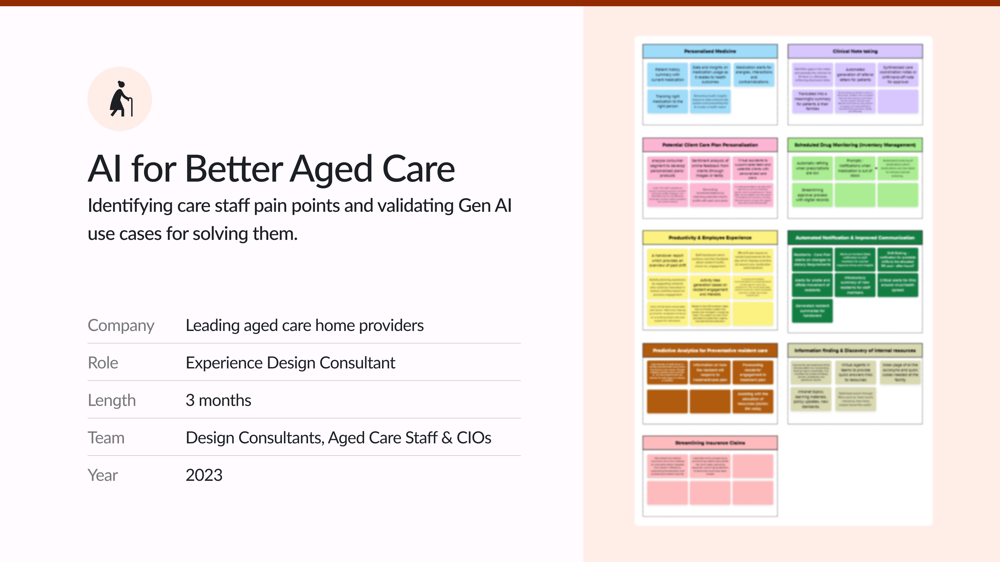
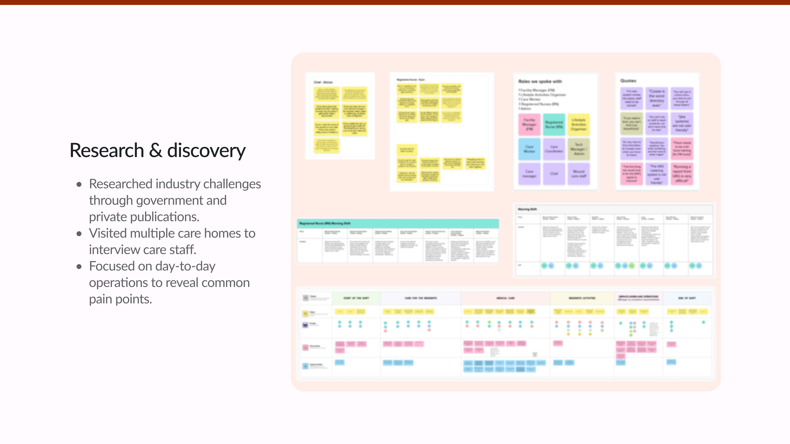
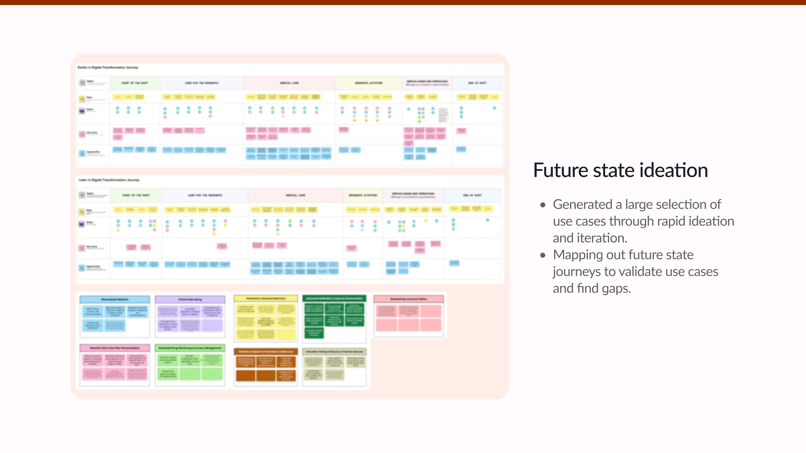
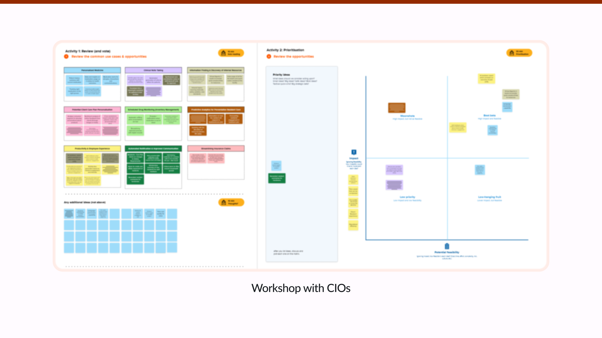

Company: Leading aged care home providers.

Role: Experience Design Consultant.

Length: 3 months.

Team: Design Consultants, Aged Care Staff & CIOs.

Year: 2023.

## Research & discovery

- Researched industry challenges through government and private publications.
- Visited multiple care homes to interview care staff.
- Focused on day-to-day operations to reveal common pain points.

## Future state ideation

- Generated a large selection of use cases through rapid ideation and iteration.
- Mapping out future state journeys to validate use cases and find gaps.

## Workshop with CIOs

