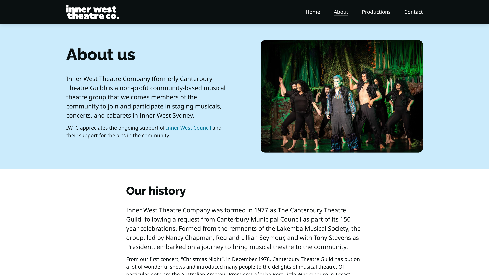

[Inner West Theatre Company](https://www.innerwesttheatre.com.au/) (formerly Canterbury Theatre Guild) is a not-for-profit community based musical theatre group where members of the community are welcome to join and participate in putting on a musical, concert and/or cabaret once or twice a year.

I have been on the committee at Inner West Theatre Company since 2015 and have been responsible for promoting our events to the community. I designed a wide range of promotional material for the company, ranging from tickets to programs, digital advertising, videos and the website.

## Projects

<ul class="projects">
  
    
  
</ul>
